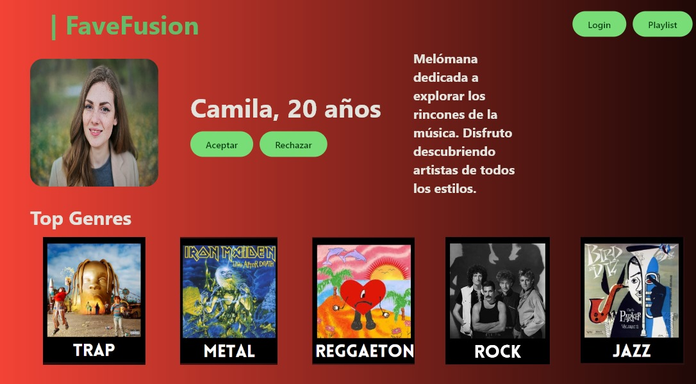

# FAVEFUSION
¡Bienvenido a la Aplicación FaveFusion!





## Descripción
FaveFusion es una aplicación web que te ayuda a descubrir nueva música y conectar con personas que comparten tus gustos musicales. Con FaveFusion, puedes explorar una amplia variedad de géneros musicales, encontrar personas con gustos similares y disfrutar de una experiencia social única.

## Características Principales
- **Inicio de Sesión y Registro:** Los usuarios pueden iniciar sesión o registrarse para acceder a la aplicación.
- **Exploración de Géneros Musicales:** Los usuarios pueden explorar una variedad de géneros musicales y agregar sus favoritos a su perfil.
- **Coincidencias de Usuarios:** FaveFusion utiliza un algoritmo de coincidencia para conectar a los usuarios con personas que comparten sus intereses musicales.
- **Perfil de Usuario:** Cada usuario tiene un perfil personalizado donde pueden ver su información y sus géneros musicales favoritos.
- **Interfaz Intuitiva:** La aplicación cuenta con una interfaz fácil de usar que permite a los usuarios navegar y interactuar sin esfuerzo.

## Instalación
1. Clona este repositorio en tu máquina local.

   ```git clone <link del repositorio>```

   
3. Asegúrate de tener Python instalado en tu sistema.

   ```python --version```

  
4. Instala las dependencias necesarias ejecutando
  
   ```pip install -r requirements.txt.```


  
5. Para ejecutar la aplicacion ejecuta el siguiente comando:

   ```flet run App.py`.```

6. Para agregar la base de datos, asegurate de tener XAMPP instalado en tu ordenador, posteriormente crea una base de datos vacía con el nombre de "spotify", luego ve a importar base de datos y seleccionas "DataBase.sql"

## Uso

Una vez que hayas instalado y ejecutado la aplicación FaveFusion, aquí te mostramos cómo puedes interactuar con ella:

1. **Iniciar Sesión**
   - Al abrir la aplicación, serás dirigido a la página de inicio de sesión.
   - Ingresa tu nombre de usuario y contraseña para acceder a tu cuenta.

2. **Explorar Funcionalidades**
   - Una vez iniciada la sesión, podrás acceder a diferentes secciones de la aplicación, como la página de inicio, la búsqueda por género, la visualización de perfiles de usuarios y la página de coincidencias (matches).
   - Utiliza los botones y enlaces proporcionados en la interfaz para navegar entre las distintas secciones.

3. **Personalizar tu Perfil**
   - En la sección de búsqueda por género, puedes seleccionar tus géneros musicales favoritos. Simplemente haz clic en los botones correspondientes a los géneros que te gustan.
   - Asegúrate de seleccionar al menos 5 géneros para obtener mejores resultados en las coincidencias.

4. **Explorar Perfiles de Usuarios**
   - Visita la sección de visualización de perfiles de usuarios para ver perfiles de otros usuarios de la aplicación.
   - Desplázate por los perfiles para conocer más detalles sobre cada usuario, como su nombre, edad, géneros musicales favoritos y una breve descripción.

5. **Interactuar con Coincidencias**
   - En la página de coincidencias, podrás ver las coincidencias de usuarios compatibles contigo.
   - Explora las coincidencias y decide si deseas enviar un mensaje a algún usuario.

6. **Cerrar Sesión**
   - Cuando hayas terminado de usar la aplicación, cierra sesión en tu cuenta para proteger tu privacidad y seguridad.

¡Disfruta explorando la diversidad musical y haciendo nuevas conexiones en FaveFusion!


## Contribución
¡Las contribuciones son bienvenidas! Si deseas contribuir a este proyecto, sigue estos pasos:
1. Haz un fork del repositorio.
2. Crea una rama para tu nueva funcionalidad (`git checkout -b feature/nueva-funcionalidad`).
3. Realiza tus cambios y asegúrate de seguir las guías de estilo y buenas prácticas.
4. Haz commit de tus cambios (`git commit -m 'Agrega nueva funcionalidad'`).
5. Sube tus cambios a tu repositorio remoto (`git push origin feature/nueva-funcionalidad`).
6. Abre un Pull Request y describe tus cambios detalladamente.

## Créditos
Este proyecto fue desarrollado por Daniel López, Dorian Ticona, Pablo Achá, Camila Bocángel, Jorge Saenz.

## Licencia
Este proyecto está bajo la licencia MIT License.


¡Listo! Ahora puedes explorar y disfrutar de la experiencia musical de FaveFusion en tu propio entorno local.
